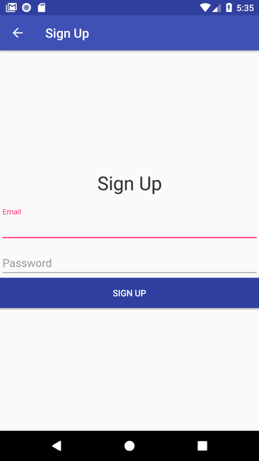

# Journal App 

This is an android journal application that can be used as a journal for writting down your thoughts, feelings and events

## Getting Started

Download the .apk and run it on your device/emulator. Otherwise clone and compile the project using Android Studio

### Pre-requisites

* A compatible Android device that runs Android 4.0 or newer and includes the Google Play Store or an emulator with an AVD that runs the Google APIs platform based on Android 4.2.2 or newer and has Google Play services version 15.0.0 or newer.

### Functions

* Register and Login using google authentication

* View all entries to their diary

* View the contents of a diary entry

* Add and modify an entry

### Extra Credits

* The can persist your data to Firebase, but cannot fetch due to permission denial error (view logcat)

### Screenshots

*  

*  

*  

*  

*  

*  

## Authors

* **AbdulHakeem AbdulAleem** 

## NOTE

This application was develop as part of the Google Africa Scholarship challenge course [alcwithgoogle](https://andela.com/alcwithgoogle/) and for that is not production ready 

* #7DaysofCodeChallenge
